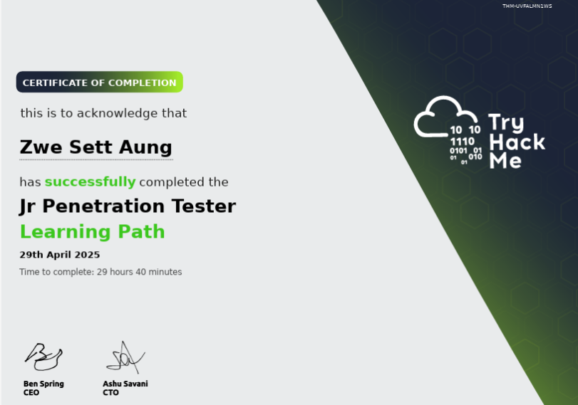

## 🏅 TryHackMe Jr Penetration Tester Certification

I successfully completed the **TryHackMe Junior Penetration Tester Learning Path** on **29th April 2025**, after **29 hours and 40 minutes** of hands-on training. This certification helped solidify my foundational skills in:

- 🖧 Networking & system fundamentals  
- 🌐 Web application security  
- 🐧 Linux & 🪟 Windows privilege escalation  
- 🔍 Enumeration, exploitation, and post-exploitation

📄 **[Click here to view the certificate (PDF)](https://tryhackme-certificates.s3-eu-west-1.amazonaws.com/THM-UVFALMN1WS.pdf)**

  

