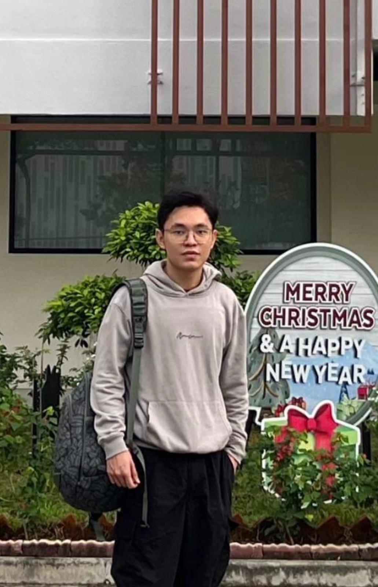

# Portfolio
Penetration testing and vulnerability assessment projects

# 👨‍💻 Zwe Sett Aung

**Age:** 20  
**Aspiring Penetration Tester**  
**Bachelor of Cybersecurity - James Cook University Singapore**

---

## 🧠 About Me

Hi, I'm Zwe — a cybersecurity graduate with a growing passion for **penetration testing** and **vulnerability assessment**. I’ve traded in hours of gaming for the thrill of **reconnaissance, enumeration, exploitation, pivoting**, and **breaking into systems (ethically, of course!)**.  

This GitHub is my personal lab — a place where I upload my **hands-on projects**, **CTF writeups**, and tools/scripts I develop along the way.

---

## 📁 What to Expect in This Portfolio

- 🔍 Penetration Testing & Red Team Projects  
- 🛡️ Vulnerability Assessment Tools  
- 🧩 CTF Writeups & Challenges ( upcoming )
- 🧪 Scripts for Enumeration & Exploitation  (upcoming) 
- 📚 Notes from Certifications & Labs (eJPT, TryHackMe, HTB, and more)

---

## 🎮 Fun Fact

Lately, penetration testing has *replaced* my gaming habit — I get the same rush from **finding flaws**, **hacking into systems**, and **solving technical puzzles**, just like leveling up in a game.

---

## 🚀 Interests & Goals

- Continuously leveling up my pentesting skills  
- Earning certifications (like eJPT, OSCP, PNPT, CRTO...) — like unlocking achievements  
- Staying curious, always learning, always breaking (ethically)

---

📫 *Let’s connect and hack (legally) together!*

